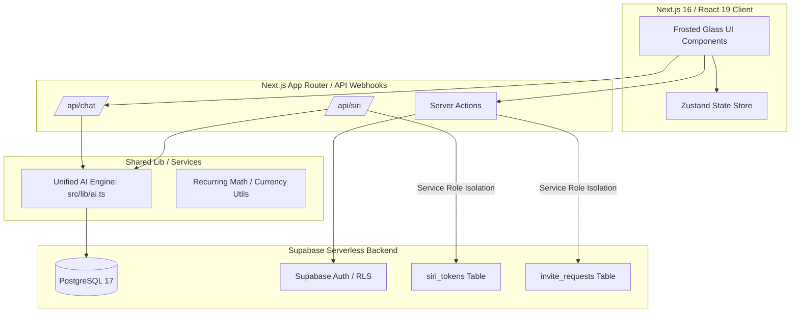
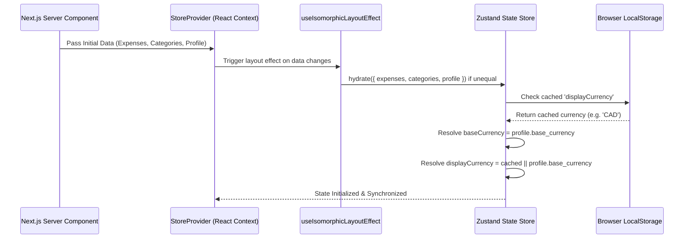
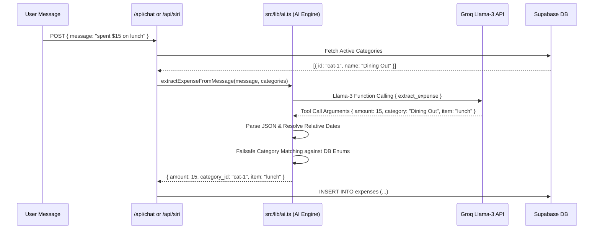

# Technical Standards & Architecture Guide
**Repository**: `lilo123/expense-dashboard` (An-yen App)
**System Version**: 2.0 (Production & Architecture Baseline)
**Scope**: Enterprise Architecture, DevSecOps Standards, AI Integration, Brand Philosophy, UI Engineering
**Date**: 2026-05-13

---

## 1. System Overview & Core Philosophy

The **An-yen** Expense Dashboard is an enterprise-grade, serverless full-stack web application designed to revolutionize personal wealth tracking by prioritizing mindfulness, psychological safety, and values alignment over punitive financial surveillance.



### The "An-yen" Persona & Psychological Safety
In direct opposition to traditional financial tracking software that leverages "Loss Aversion" and anxiety-inducing visual design (e.g., harsh red deficit warnings, alarming push notifications), An-yen embodies a nurturing, empathetic financial mentor. 

### The "No Game Overs" Philosophy
The application is engineered around a core tenet: **"No Game Overs."** Financial miscalculations or budgetary overflows are treated as natural ebbs and flows of human life rather than catastrophic failures. The UI explicitly rejects traditional deficit highlighting; instead, it utilizes soothing, affirmative design cues that encourage consistent reflection and realignment with the user's inner values.

---

## 2. Visual Identity & UI Engineering

An-yen's visual identity is meticulously crafted to evoke tranquility, fluidity, and premium craftsmanship, utilizing Tailwind CSS v4 and native CSS animations.

```mermaid
graph LR
    subgraph Visual Engine [Tailwind v4 / Native CSS]
        Mesh[Mesh Gradient Background]
        Glass[Frosted Glass Cards]
        Blob[Fluid Orb Animation]
        Vector[ay Continuous Line Logo]
    end

    Mesh -->|bg-gradient-to-br| Body[Application Body]
    Glass -->|backdrop-blur-md bg-white/40| UI[Pill-Shaped Components]
    Blob -->|@keyframes morph| AI[AI Assistant Avatar]
    Vector -->|SVG ViewBox| Brand[Navbar / Header]
```

### Tailwind Mesh Gradient Implementation
The application foundation relies on a signature, soothing multi-stop mesh gradient applied directly to the root layout body (`src/app/layout.tsx`). This specific gradient transitions smoothly across the custom Zen color palette:
```tsx
<body className="bg-gradient-to-br from-[#FAF9F6] via-[#F9E4D4] to-[#D8D2E1] min-h-screen text-zen-charcoal antialiased">
```
- `#FAF9F6` (`zen-base`): Warm, calming off-white foundation.
- `#F9E4D4` (`zen-peach`): Soft, organic sunset peach accent.
- `#D8D2E1` (`zen-lavender`): Muted, grounding dusk lavender.

### Frosted-Glass Pill Components
All interactive UI elements, cards, and modals adhere strictly to a pill-shaped, frosted-glass architectural pattern. This is achieved by combining heavy backdrop blurring with translucent white surface layers and subtle borders:
```css
@apply bg-white/40 backdrop-blur-md border border-white/20 shadow-sm rounded-3xl;
```

### Pure CSS Blob Animation (AI Orb)
The AI Assistant visual avatar (`AnyenOrb`, `AnyenAvatar`) features a hypnotic, liquid-flow morphing animation defined via pure CSS `@keyframes` in `src/app/globals.css`:
```css
@keyframes morph {
  0%, 100% { border-radius: 60% 40% 30% 70% / 60% 30% 70% 40%; }
  50% { border-radius: 30% 60% 70% 40% / 50% 60% 30% 60%; }
}
.animate-liquid-flow {
  animation: morph 8s ease-in-out infinite;
}
```

### The 'ay' Continuous Line Vector Logo
The application branding centers around the `Logo.tsx` component, which renders a beautifully intricate, continuous line vector illustration of the letters 'ay' (An-yen). The logo is fully scalable via an exact SVG viewBox (`0 0 1791 1211`) and inherits dynamic text coloring (`currentColor`) to maintain high-contrast compliance against the mesh gradient.

---

## 3. Frontend Architecture

### Next.js App Router & React 19 Foundation
The frontend leverages Next.js 16 paired with React 19 concurrent rendering models.
- **App Router Routing (`src/app`)**: Houses top-level page definitions, root layout wrappers, and API route webhooks. Integrates **nested sub-layouts (`/budget/layout.tsx`)** to enforce strict max-width structural container isolation across dynamic route streams, fully immunizing skeletons and pages against Cumulative Layout Shift (CLS).
- **Component Modularization (`src/components`)**: Encapsulates visual features into highly focused, reusable React building blocks.
- **Server vs. Client Boundaries**: Strict separation of rendering environments. Core page layouts operate on the server, while interactive stateful components (charts, modals, filters) declare `'use client'` at their module boundaries.

### Zustand Client Store Lifecycle (`src/store/useExpenseStore.tsx`)
Client state is governed by a robust Zustand store instance instantiated within a request-scoped React Context (`StoreProvider`). 

To prevent React 19 render-phase state warnings, store hydration is synchronized using an **Isomorphic Layout Effect wrapper (`useIsomorphicLayoutEffect`)** which executes store updates synchronously *after* component commit but *before* browser paint. Deep comparative check `areInitialDataEqual` gates hydration to run only when incoming Server Component prop properties truly change, eliminating redundant state updates.


```

#### Dual Currency Hydration Lifecycle
The store natively tracks two financial currency dimensions:
1. `baseCurrency`: The user's primary account currency used for recording underlying database transactions.
2. `displayCurrency`: The current active visualization currency selected by the user for chart rendering and UI lists.

When the store is hydrated on page load, the `hydrate()` method executes a highly safe synchronization algorithm:
```typescript
let preferredDisplay: SupportedCurrency | null = null;
if (typeof window !== 'undefined') {
  const stored = localStorage.getItem('displayCurrency');
  if (stored) preferredDisplay = stored as SupportedCurrency;
}
const hydratedBase = data.baseCurrency || (activeProfile ? activeProfile.base_currency : state.baseCurrency);
const hydratedDisplay = data.displayCurrency || preferredDisplay || (activeProfile ? activeProfile.base_currency : state.displayCurrency);
```
This ensures that user currency preferences persist seamlessly across browser sessions while remaining tightly synchronized with backend database profile metadata.

---

## 4. Backend & DevSecOps

### Supabase Service Role Isolations
To guarantee strict data security and protect public endpoints from exploitation, the backend architecture enforces isolated service role execution (`SUPABASE_SERVICE_ROLE_KEY`) across two critical domains:

```mermaid
graph TD
    subgraph Webhooks / Server Actions
        SiriAPI[/api/siri/route.ts]
        InviteAction[requestInviteAction]
    end

    subgraph Supabase Engine
        ServiceKey[Service Role Client]
        RLS[Row Level Security]
        SiriTokens[siri_tokens Table]
        InviteTable[invite_requests Table]
    end

    SiriAPI -->|Verify Hash| ServiceKey
    InviteAction -->|Direct Log| ServiceKey
    ServiceKey -->|Bypass RLS Securely| SiriTokens
    ServiceKey -->|Bypass RLS Securely| InviteTable
    RLS -.->|Blocks Public Access| SiriTokens
    RLS -.->|Blocks Public Access| InviteTable
```

#### 1. `invite_requests` Isolation
The `invite_requests` table maintains strict Row Level Security (RLS) policies that completely block public unauthenticated insertions. When a prospective user submits an invitation request, `requestInviteAction` in `src/app/actions.ts` instantiates a dedicated backend Supabase client using the service role key. This allows the server action to bypass RLS securely on the backend and insert the record without exposing public write access.

#### 2. `siri_tokens` Cryptographic Architecture
Siri webhook authentication is isolated within a dedicated `siri_tokens` table (`id`, `user_id`, `token_hash`, `created_at`).
- **Token Generation**: `generateSiriTokenAction` creates 32 bytes of secure random hex, computes a SHA-256 cryptographic hash, stores the hash in the database, and displays the raw token to the user exactly once.
- **Token Verification**: Incoming Siri webhooks to `/api/siri` provide the raw token in the `Authorization` header. The endpoint hashes the incoming token and queries `siri_tokens` using a service role client to securely resolve the authenticated `user_id`.

### PL/pgSQL Automated Recurring Schedule Worker
Automated recurring expenses are processed by an advanced PostgreSQL database worker function `process_recurring_expenses()`.
- **Timezone-Aware Logging**: The worker joins recurring configurations with user profiles (`p.timezone`) to evaluate due dates against the user's exact geographic timezone date (`timezone(p.timezone, now())::date`), guaranteeing precise midnight execution.
- **Expiration Bounds**: The worker increments `num_occurrences` on every execution and automatically toggles `is_active = false` when schedules exceed `max_occurrences` caps or cross `end_date` calendar boundaries.

---

## 5. AI Orchestration (`src/lib/ai.ts`)

All conversational AI and spoken expense logging flows are orchestrated by a unified AI service located in `src/lib/ai.ts`.



### Unified Groq Llama-3 Extraction Engine
The AI engine connects to Groq's ultra-fast inference API using the `llama-3.1-8b-instant` model and mandates strict structured output via function calling tool schemas (`extract_expense`).

#### Relative Date Resolution Math
To guarantee data accuracy, the system prompt injects today's exact reference date (`YYYY-MM-DD`). The extraction engine mathematically resolves relative natural language descriptors (e.g., "yesterday", "last Friday") and converts them into strict UTC ISO timestamp strings before database insertion:
```typescript
const dateStrLower = String(resolvedDate).toLowerCase().trim();
if (dateStrLower === 'yesterday') {
  const d = new Date(); 
  d.setDate(d.getDate() - 1); 
  resolvedDate = d.toISOString().split('T')[0];
} else if (dateStrLower === 'today') {
  resolvedDate = todayStr;
}
```

#### Failsafe Category Fallback Algorithm
To prevent database foreign key constraint violations caused by LLM hallucinations, the engine executes a robust category fallback matching algorithm:
1. **Direct Match**: Validates the LLM category output case-insensitively against the user's active database category list.
2. **Generic Fallback**: If no exact match is found, searches for generic fallback categories ("Misc", "Miscellaneous", "Other").
3. **Absolute Fallback**: If generic categories do not exist, defaults to the user's first available category ID, guaranteeing that the expense is successfully logged without throwing runtime exceptions.

---
*End of Guide.*
